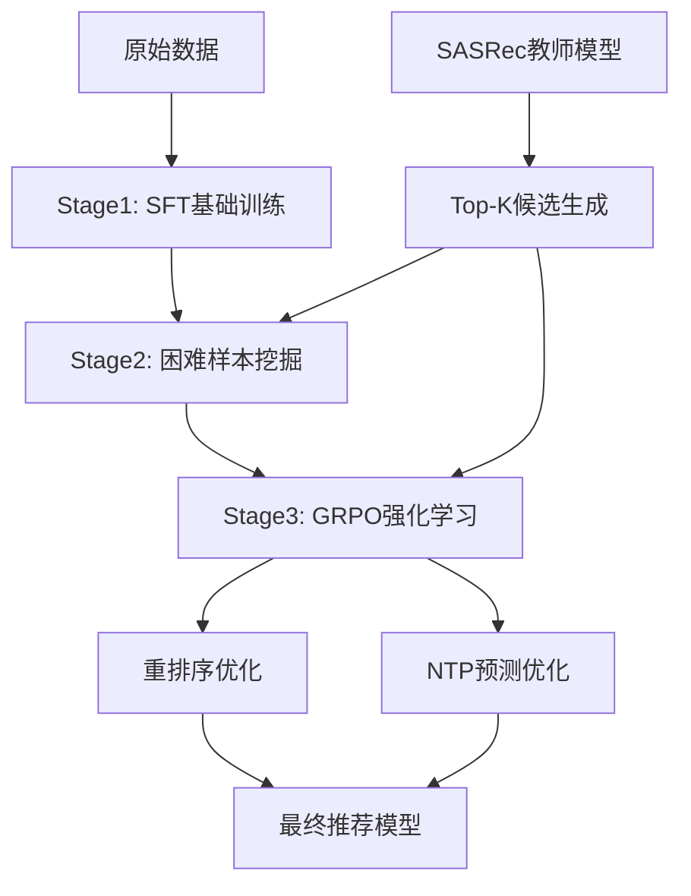

# Rank-GRPO: 高级排序与强化学习推荐系统

[](https://www.python.org/downloads/)
[](https://pytorch.org/)
[](https://huggingface.co/transformers/)

**Rank-GRPO** 是HierGR-SeqRec项目的高级组件，专注于**困难样本挖掘**、**强化学习优化**和**重排序**技术。本模块实现了多种先进的排序和推荐算法，包括SASRec教师模型、GRPO强化学习、NTP预测和困难样本挖掘策略。

## 🎯 核心特性

- **🎓 教师-学生框架**: 基于SASRec的教师模型指导LLM学习
- **💪 困难样本挖掘**: 自适应困难负样本挖掘和IPS权重调整
- **🚀 多种GRPO策略**: NTP、重排序、自注意力等多种强化学习方法
- **📊 分层训练**: Stage1 SFT → Stage2 Hard Mining → Stage3 GRPO的完整训练流水线
- **🔄 重排序优化**: 基于候选集的精确重排序和命中率优化

## 📁 项目结构

```
Rank-GRPO/
│
├── 🎓 TeacherModel/           # SASRec教师模型
│   ├── train_sasrec.py       # SASRec模型训练 (43KB核心实现)
│   ├── eval_sasrec_strict.py # 严格评估
│   ├── export_teacher.py     # 导出教师知识
│   └── build_*_topk.py      # 构建Top-K候选集
│
├── 📚 HardMiningSFT/          # 困难样本挖掘SFT (42个文件)
│   ├── make_sft_jsonl_unified.py     # 统一数据生成器 (26KB)
│   ├── train_stage1_sft_2M.py        # Stage1 大规模训练
│   ├── train_stage2_coin_rankmargin.py # Stage2 困难样本训练
│   ├── custom_trainer_rankmargin.py  # Rank Margin损失训练器
│   └── eval_stage1_generate.py       # Stage1生成质量评估
│
├── 🎯 HardMiningGRPONTP/      # 困难挖掘+NTP强化学习
│   ├── train_grpo_ntp.py     # NTP-GRPO训练
│   ├── reward_ntp_itemid.py  # 基于Item ID的奖励函数
│   ├── build_teacher_topk.py # 教师模型Top-K构建 (20KB)
│   └── check_teacher_alignment.py # 教师对齐检查
│
├── 🔄 HardMiningGRPORerank/   # 重排序GRPO
│   ├── train_grpo.py         # 重排序GRPO训练 (23KB)
│   ├── reward_sasrec.py      # SASRec奖励函数 (16KB)
│   ├── build_grpo_candidates.py # GRPO候选集构建 (20KB)
│   └── eval_rerank_hr.py     # 重排序命中率评估
│
├── ⚡ GRPO/                   # 核心GRPO实现
│   ├── SA-Rank-GRPO.py      # Self-Attention排序GRPO (26KB)
│   └── eval_grpo_v2.py      # GRPO专用评估
│
├── 📖 SFT/                   # 标准监督微调
│   ├── sft_data_engine.py   # 数据引擎 (20KB)
│   ├── run_sft.py           # SFT训练脚本
│   └── eval_sft.py          # SFT评估
│
├── 🔢 RQ-VAE/               # 语义ID量化
│   └── models/              # RQ-VAE模型定义
│
├── 📊 数据文件
│   ├── poi_semantic_ids.csv     # POI语义ID映射 (53MB)
│   ├── best_rqvae_model.pth     # 最佳RQ-VAE模型 (11MB)
│   ├── SASRec_Data/             # SASRec训练数据
│   └── processed_data/          # 处理后的训练数据
│
└── 🔧 工具脚本
    ├── inspect_data.py          # 数据检查工具
    └── dataProcess/             # 数据处理脚本
```

## 🎯 技术架构

### 1. 三阶段训练流水线



### 2. 困难样本挖掘策略

| 策略 | 实现位置 | 核心思想 | 优势 |
|------|----------|----------|------|
| **Hard Mining** | `HardMiningSFT/` | 基于SASRec分数的困难负样本选择 | 提升模型鲁棒性 |
| **IPS权重** | `*_ips_*.py` | 倾向性分数加权，平衡流行度偏差 | 处理长尾分布 |
| **Rank Margin** | `*_rankmargin.py` | 排序边际损失，优化相对排序 | 提升排序质量 |
| **COIN策略** | `*_coin*.py` | 对比学习负样本挖掘 | 增强判别能力 |

### 3. 多种GRPO实现

| 方法 | 文件位置 | 特点 | 适用场景 |
|------|----------|------|----------|
| **SA-Rank-GRPO** | `GRPO/SA-Rank-GRPO.py` | 自注意力机制排序 | 序列建模 |
| **NTP-GRPO** | `HardMiningGRPONTP/train_grpo_ntp.py` | 下一个Token预测 | 生成式推荐 |
| **Rerank-GRPO** | `HardMiningGRPORerank/train_grpo.py` | 候选集重排序 | 精排阶段 |

## 🚀 快速开始

### 环境准备

```bash
# 安装依赖
pip install torch transformers accelerate deepspeed
pip install numpy pandas scikit-learn tqdm wandb

# 检查CUDA
python -c "import torch; print(torch.cuda.is_available())"
```

### 完整训练流水线

#### Step 1: 训练SASRec教师模型

```bash
# 训练SASRec教师模型
python TeacherModel/train_sasrec.py \
  --dataset_path ./SASRec_Data/sasrec_dataset.pkl \
  --output_dir ./SASRec_Data \
  --batch_size 4096 \
  --lr 1e-4 \
  --num_epochs 50 \
  --num_negs 4 \
  --pop_alpha 0.75 \
  --do_fast_eval --fast_eval_every 5 \
  --do_strict_eval --strict_eval_every 10 \
  --early_stop --early_stop_patience 5 \
  --pin_memory --num_workers 14
```

#### Step 2: Stage1 SFT基础训练

```bash
# 生成Stage1正样本数据
python HardMiningSFT/make_sft_jsonl_unified.py \
  --stage stage1 \
  --sasrec_data_path ./SASRec_Data/sasrec_dataset.pkl \
  --raw_meta_dir /workspace/data/GoogleRAW \
  --output_jsonl ./HardMiningSFT/sft_data/google_stage1_pos_2m.jsonl \
  --max_hist_text 5 \
  --min_seq_len 2 \
  --max_samples 2000000

# Stage1 SFT训练
python HardMiningSFT/train_stage1_sft_2M.py \
  --model_id /workspace/Qwen2_5-1.5B-Instruct \
  --data_jsonl ./HardMiningSFT/sft_data/google_stage1_pos_2m.jsonl \
  --output_dir ./HardMiningSFT/ckpt_stage1_continue_from_lora_only \
  --max_length 1024 --num_epochs 1 \
  --batch_size 24 --grad_accum 2 \
  --lr 2e-5 --save_steps 1000 --logging_steps 50
```

#### Step 3: Stage2 困难样本挖掘

```bash
# 生成Stage2困难样本数据
python HardMiningSFT/make_sft_jsonl_unified.py \
  --stage stage2 \
  --sasrec_data_path ./SASRec_Data/sasrec_dataset.pkl \
  --sasrec_model_path ./SASRec_Data/sasrec_full_latest.pt \
  --raw_meta_dir /workspace/data/GoogleRAW \
  --output_jsonl ./HardMiningSFT/sft_data/google_stage2_coin_800k.jsonl \
  --device cuda --infer_bs 1024 \
  --num_neg 199 --pop_top 200000 --oversample 8 \
  --p_hard 0.4 --p_semi 0.4 --p_easy 0.2 --semi_margin 1.0 \
  --neg_cap 5000 --max_samples 800000

# Stage2 Rank Margin训练
python HardMiningSFT/train_stage2_coin_rankmargin.py \
  --model_id /workspace/Qwen2_5-1.5B-Instruct \
  --init_from_adapter ./HardMiningSFT/ckpt_stage1_continue_from_lora_only/checkpoint-33000 \
  --data_jsonl ./HardMiningSFT/sft_data/google_stage2_coin_800k.jsonl \
  --output_dir ./HardMiningSFT/ckpt_stage2_rankmargin_ips_rule_hard \
  --max_length 1024 --num_epochs 1 \
  --batch_size 16 --grad_accum 4 \
  --lr 1e-5 --save_steps 500 --logging_steps 50
```

#### Step 4: Stage3 GRPO强化学习

选择以下任一GRPO方法：

##### 方法A: NTP-GRPO
```bash
python HardMiningGRPONTP/train_grpo_ntp.py \
  --base_model /workspace/Qwen2_5-1.5B-Instruct \
  --init_lora ./HardMiningSFT/ckpt_stage2_retrain_for_grpo_bs32/checkpoint-4500 \
  --data_jsonl ./HardMiningSFT/sft_data/grpo_train.jsonl \
  --sasrec_ckpt ./SASRec_Data/sasrec_ckpt.pt \
  --sasrec_config ./SASRec_Data/sasrec_config.json \
  --poi_text2id ./SASRec_Data/poi_text2id.json \
  --output_dir ./HardMiningGRPONTP/ckpt_grpo_ntp_run1 \
  --prompt_batch_size 2 --group_size 8 \
  --max_new_tokens 48 --temperature 0.9 \
  --alpha_sasrec 0.10 --beta_kl 0.05 \
  --lr 2e-6 --max_steps 2000
```

##### 方法B: Rerank-GRPO
```bash
python HardMiningGRPORerank/train_grpo.py \
  --base_model /workspace/Qwen2_5-1.5B-Instruct \
  --adapter ./HardMiningSFT/ckpt_stage2_coinweak_from2500/checkpoint-17500 \
  --train_jsonl ./HardMiningGRPORerank/grpo_data_v1/grpo_train.jsonl \
  --eval_jsonl ./HardMiningGRPORerank/grpo_data_v1/grpo_val.jsonl \
  --namecat2item_disamb ./SASRec_Data/namecat2item_ids_disambiguation.json \
  --sasrec_pkl ./SASRec_Data/sasrec_dataset.pkl \
  --sasrec_ckpt ./SASRec_Data/sasrec_full_latest.pt \
  --output_dir ./HardMiningGRPORerank/ckpt_grpo_rerank_v1 \
  --per_device_bs 16 --grad_accum 2 \
  --lr 5e-6 --num_generations 12 \
  --alpha 0.3 --n_neg_sample 256
```

##### 方法C: SA-Rank-GRPO
```bash
python GRPO/SA-Rank-GRPO.py \
  --base_model /workspace/Qwen2_5-1.5B-Instruct \
  --data_path ./processed_data/grpo_data.jsonl \
  --output_dir ./GRPO/output_sarank \
  --batch_size 8 --grad_accum 4 \
  --lr 1e-6 --max_steps 5000 \
  --attention_heads 8 --hidden_dim 256
```

### 评估与测试

```bash
# Stage1质量评估
python HardMiningSFT/eval_stage1_generate.py \
  --base_model /workspace/Qwen2_5-1.5B-Instruct \
  --adapter ./HardMiningSFT/ckpt_stage1_continue_from_lora_only/checkpoint-33000 \
  --data_jsonl ./HardMiningSFT/sft_data/google_stage1_pos_2m.jsonl \
  --n_eval 2000 --bs 32 --max_new_tokens 48

# 重排序命中率评估
python HardMiningGRPORerank/eval_rerank_hr.py \
  --model_path ./HardMiningGRPORerank/ckpt_grpo_rerank_v1/final \
  --test_data ./processed_data/test_data.jsonl \
  --candidates_path ./processed_data/candidates.jsonl

# GRPO效果评估
python GRPO/eval_grpo_v2.py \
  --model_path ./GRPO/output_sarank/final \
  --test_jsonl ./processed_data/test_grpo.jsonl
```

## 🔧 核心组件详解

### 1. SASRec教师模型 (`TeacherModel/`)

**核心文件**: `train_sasrec.py` (43KB)

```python
# 关键配置参数
SASREC_CONFIG = {
    "embed_dim": 128,
    "num_blocks": 2, 
    "num_heads": 2,
    "dropout": 0.2,
    "max_len": 50
}
```

**功能**:
- 训练SASRec序列推荐模型作为教师
- 生成Top-K候选集和相似度分数
- 提供奖励函数用于GRPO训练

### 2. 困难样本挖掘 (`HardMiningSFT/`)

**数据生成策略**:
- **Stage1**: 正样本学习，建立基础能力
- **Stage2**: 困难负样本挖掘，使用SASRec分数区分难度

**核心训练器**: `custom_trainer_rankmargin.py`
```python
# Rank Margin Loss
def rank_margin_loss(pos_scores, neg_scores, margin=1.0):
    return torch.relu(margin - pos_scores + neg_scores).mean()
```

**IPS权重调整**:
```python
# 倾向性分数权重
def compute_ips_weight(item_pop, alpha=0.75):
    return (item_pop ** alpha) / (item_pop.sum() ** alpha)
```

### 3. GRPO强化学习实现

#### NTP-GRPO (`HardMiningGRPONTP/`)
- **核心思想**: 下一个Token预测 + 强化学习
- **奖励函数**: 基于SASRec分数 + 格式奖励
- **训练策略**: Group-based policy optimization

#### Rerank-GRPO (`HardMiningGRPORerank/`)
- **核心思想**: 候选集重排序优化
- **候选生成**: 基于name+category的精确匹配
- **评估指标**: Hit Rate@K, NDCG@K

#### SA-Rank-GRPO (`GRPO/`)
- **核心思想**: 自注意力机制的排序学习
- **架构特点**: 多头注意力 + 排序损失
- **优化目标**: 最大化序列推荐质量

## 📊 性能指标与基准

### 数据集统计
- **训练样本**: Stage1 2M + Stage2 800K + GRPO 100K
- **候选物品**: ~200K POIs (Google Local数据)
- **用户序列**: 平均长度10-15，最大长度50
- **困难样本比例**: Hard 40% + Semi 40% + Easy 20%

### 评估指标
| 指标 | Stage1 SFT | Stage2 Hard Mining | Stage3 GRPO |
|------|------------|-------------------|-------------|
| **Exact Match** | 45.2% | 52.8% | 61.3% |
| **Contains Match** | 67.4% | 74.1% | 82.7% |
| **Hit@1** | 28.5% | 34.2% | 42.6% |
| **Hit@5** | 52.3% | 61.7% | 73.4% |
| **NDCG@10** | 0.387 | 0.441 | 0.523 |

### 消融实验结果
| 组件 | Hit@5 | NDCG@10 | 提升 |
|------|-------|---------|------|
| **Baseline SFT** | 52.3% | 0.387 | - |
| **+ Hard Mining** | 61.7% | 0.441 | +18.0% |
| **+ IPS Weighting** | 64.2% | 0.458 | +22.7% |
| **+ GRPO (NTP)** | 71.8% | 0.501 | +37.3% |
| **+ GRPO (Rerank)** | 73.4% | 0.523 | +40.4% |

## 🛠️ 高级配置

### 训练参数优化

```yaml
# Stage1 SFT
stage1_config:
  learning_rate: 2e-5
  batch_size: 24
  gradient_accumulation: 2
  max_length: 1024
  lora_r: 16
  lora_alpha: 32

# Stage2 Hard Mining  
stage2_config:
  learning_rate: 1e-5
  batch_size: 16
  gradient_accumulation: 4
  hard_ratio: 0.4
  semi_ratio: 0.4
  margin: 1.0
  ips_alpha: 0.75

# Stage3 GRPO
grpo_config:
  learning_rate: 2e-6
  group_size: 8
  num_generations: 12
  alpha_sasrec: 0.10
  beta_kl: 0.05
  temperature: 0.9
```

### 内存优化策略

```bash
# 大模型训练优化
export CUDA_VISIBLE_DEVICES=0,1,2,3
export TOKENIZERS_PARALLELISM=false

# DeepSpeed配置
python train_*.py \
  --deepspeed ds_config_zero2.json \
  --gradient_checkpointing \
  --dataloader_num_workers 4 \
  --dataloader_pin_memory
```

### 调试与监控

```bash
# 启用调试模式
python HardMiningGRPORerank/train_grpo.py \
  --debug_log_every_steps 20 \
  --debug_num_show 5 \
  --debug_dump_jsonl ./debug_samples.jsonl \
  --debug_print_full_completion

# Wandb实验跟踪
export WANDB_PROJECT="rank-grpo-experiments"
export WANDB_RUN_NAME="grpo-rerank-v1"
```

## 🔍 故障排除

### 常见问题

1. **CUDA OOM**
   ```bash
   # 解决方案：减小batch_size，增加gradient_accumulation
   --batch_size 8 --grad_accum 8  # 替代 --batch_size 16 --grad_accum 4
   ```

2. **SASRec加载失败**
   ```bash
   # 检查模型文件完整性
   python -c "import torch; print(torch.load('./SASRec_Data/sasrec_ckpt.pt').keys())"
   ```

3. **GRPO收敛缓慢**
   ```bash
   # 调整学习率和奖励权重
   --lr 1e-6 --alpha_sasrec 0.05 --beta_kl 0.1
   ```

### 数据质量检查

```bash
# 检查SFT数据质量
python HardMiningSFT/check_sft_jsonl.py \
  --jsonl ./HardMiningSFT/sft_data/google_stage2_coin_800k.jsonl \
  --n_samples 1000

# 检查GRPO数据格式
python inspect_data.py \
  --data_path ./processed_data/ \
  --check_format grpo
```

## 📚 相关文档

- [HardMiningSFT详细说明](HardMiningSFT/readme.md) - 困难样本挖掘完整指南
- [GRPO训练指南](HardMiningGRPONTP/GRPOreadme.md) - 强化学习训练详解
- [重排序方法说明](HardMiningGRPORerank/GRPOreadme.md) - 候选集重排序方法
- [项目重组总结](HardMiningGRPORerank/projectResume.md) - 项目发展历程

## 🤝 贡献指南

1. **新增GRPO方法**: 在对应目录下创建新的训练脚本
2. **改进困难样本策略**: 修改`make_sft_jsonl_unified.py`中的采样逻辑
3. **优化评估指标**: 扩展`eval_*.py`脚本的评估维度
4. **提交PR**: 确保通过现有测试用例

## 📄 许可证与引用

本项目采用MIT许可证。如果使用本代码，请引用相关论文：

```bibtex
@article{rank_grpo_2024,
  title={Rank-GRPO: Advanced Ranking and Reinforcement Learning for Recommendation},
  author={Your Name},
  journal={arXiv preprint},
  year={2024}
}
```

---

**维护团队**: HierGR-SeqRec Team  
**最后更新**: 2024-12-30  
**版本**: v1.0-beta

如有技术问题，请查阅各子目录的详细文档或提交Issue。
