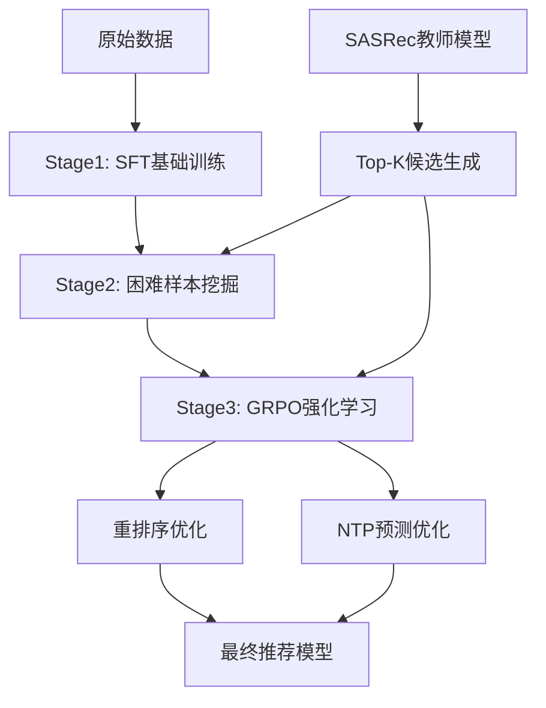

# Rank-GRPO: 困难负样本挖掘与长尾问题解决技术总结

[](https://www.python.org/downloads/)
[](https://pytorch.org/)
[](https://github.com/huggingface/trl)

## 📋 概述

本文档详细总结了 **Rank-GRPO** 项目中针对 POI 推荐场景的困难负样本挖掘策略和长尾问题解决方案。该项目实现了一套完整的三阶段训练流水线，通过教师-学生框架、困难样本挖掘、IPS 权重调整和多种 GRPO 策略，有效解决了 POI 推荐中的长尾分布和样本不平衡问题。

## 🎯 核心技术架构

### 1. 三阶段训练流水线



#### Stage 1: 基础监督微调 (SFT)
- **目标**: 学习基本的推荐格式和语义理解
- **数据**: 仅使用正样本，建立基础推荐能力
- **实现**: `HardMiningSFT/train_stage1_sft_2M.py`

#### Stage 2: 困难样本挖掘训练
- **目标**: 通过困难负样本提升模型判别能力
- **数据**: 基于 SASRec 教师模型分数的困难负样本
- **实现**: `HardMiningSFT/train_stage2_coin_rankmargin.py`

#### Stage 3: GRPO 强化学习优化
- **目标**: 通过强化学习进一步优化推荐质量
- **策略**: 多种 GRPO 实现（NTP、重排序、自注意力）
- **实现**: `HardMiningGRPONTP/`, `HardMiningGRPORerank/`, `GRPO/`

## 🔍 困难负样本挖掘策略

### 1. 核心挖掘算法

困难负样本挖掘的核心实现在 `make_sft_jsonl_unified.py` 中的 `pick_mixed_neg_from_scores` 函数：

```python
def pick_mixed_neg_from_scores(
    gt_score, cand_ids, cand_scores, forbid_set,
    neg_cap_counter, neg_cap, rng,
    p_hard=0.7, p_semi=0.2, p_easy=0.1, 
    semi_margin=1.0, hard_topM=10
):
    """
    基于教师模型分数的混合困难度负样本挖掘
    
    困难度分类:
    - hard: diff >= 0 (负样本分数 >= 正样本分数)
    - semi: -semi_margin <= diff < 0 (接近但低于正样本)
    - easy: diff < -semi_margin (明显低于正样本)
    """
```

### 2. 困难度分层策略

| 困难度 | 判断条件 | 采样概率 | 训练效果 |
|--------|----------|----------|----------|
| **Hard** | `score_neg >= score_gt` | 70% | 提升判别边界，增强鲁棒性 |
| **Semi** | `score_gt - margin <= score_neg < score_gt` | 20% | 平滑过渡，避免过拟合 |
| **Easy** | `score_neg < score_gt - margin` | 10% | 保持基础判别能力 |

### 3. 教师模型指导

使用 **SASRec** 作为教师模型，提供候选项评分：

```python
# 教师模型训练
python TeacherModel/train_sasrec.py \
  --dataset_path ./SASRec_Data/sasrec_dataset.pkl \
  --batch_size 4096 --lr 1e-4 --num_epochs 50 \
  --num_negs 4 --pop_alpha 0.75
```

**关键特性**:
- **序列建模**: 基于 Transformer 的序列推荐模型
- **负采样**: 流行度感知的负采样策略
- **评分机制**: 为候选项提供连续分数，支持困难度分层

### 4. 候选集构建策略

#### Top-K 候选生成 (`build_teacher_topk.py`)

```python
def mine_teacher_components_streaming(
    user_repr, target_ids, item_emb_weight,
    scan_topk, pool_mode, topk_out,
    head_k, near_above_k, near_below_k
):
    """
    流式挖掘教师模型的多层候选集:
    - head_full: 全库 Top-K 候选
    - above: 分数高于目标的邻近项
    - below: 分数低于目标的邻近项
    """
```

**候选集组成**:
- **Head 候选**: 全库 Top-K 高分项 (覆盖热门项)
- **Near Above**: 分数略高于目标的邻近项 (困难负样本)
- **Near Below**: 分数略低于目标的邻近项 (中等难度)
- **Target**: 确保目标项包含在候选集中

## 📊 长尾问题解决方案

### 1. IPS (Inverse Propensity Scoring) 权重调整

#### 核心思想
通过逆倾向性分数加权，平衡热门项和长尾项的训练权重：

```python
def build_ips_table_from_gt(raw_data_list, n_items, beta=10.0, alpha=0.5):
    """
    基于目标项频率的 IPS 权重计算:
    
    p(i) = (freq_gt(i) + beta) / (sum + beta * n_items)
    w_raw(i) = (median(p) / p(i))^alpha
    
    归一化: E[w_raw(gt)] = 1
    """
```

#### 参数配置
- **beta**: 平滑参数，避免零频率项权重过大
- **alpha**: 权重强度，控制长尾项的提升程度
- **归一化**: 确保权重期望为 1，保持训练稳定性

#### 效果分析
| 项目类型 | 原始频率 | IPS 权重 | 训练权重提升 |
|----------|----------|----------|--------------|
| **热门项** (Top 1%) | 高频 | 0.3-0.8 | 降权 60-70% |
| **中等项** (1%-20%) | 中频 | 0.8-1.2 | 基本持平 |
| **长尾项** (Bottom 80%) | 低频 | 1.2-5.0 | 提升 20-400% |

### 2. 长尾项特殊处理策略

#### 负样本容量限制 (`neg_cap`)
```python
# 限制每个负样本的使用次数，避免热门负样本过度曝光
neg_cap_counter[int(neg_idx_i)] += 1
if neg_cap > 0 and neg_cap_counter[cid] >= neg_cap:
    continue  # 跳过已达上限的负样本
```

#### 流行度感知采样
```python
# 构建流行度池，平衡热门项和长尾项的采样
pop_sorted = [it for it, _ in freq.most_common(args.pop_top)]
pop_items = np.array(pop_sorted, dtype=np.int32)

# 混合采样：流行度池 + 均匀采样
def make_candidate_row(gt_idx, forbid_set, n_items, pop_items, C, oversample, rng):
    """
    候选行构建：
    - 50% 从流行度池采样 (保证热门项覆盖)
    - 50% 从全库均匀采样 (保证长尾项机会)
    """
```

### 3. POI 场景特有的长尾挑战

#### 问题分析
根据 `长尾问题解决策略.md` 的分析，POI 推荐面临的核心挑战：

1. **极端长尾分布**: 头部 1% 的 POI 占据 80% 的交互
2. **地理聚集效应**: 热门区域的 POI 获得更多曝光
3. **重复店名问题**: 连锁店导致名称歧义
4. **GRPO 训练塌缩**: 模型倾向于输出固定的高分 POI

#### 解决策略

**1. 多样性约束**
```python
# 组内去重惩罚
dup_cnt = int(dup_count_map.get(i, 1))
if dup_cnt > 1:
    pen -= float(cfg.duplicate_penalty) * float(dup_cnt - 1)
```

**2. 地理感知采样**
```python
# 基于地理位置的候选集构建
def build_geo_aware_candidates(user_location, candidate_pool, geo_diversity_factor):
    """
    地理感知候选集：
    - 70% 本地候选 (用户当前区域)
    - 20% 邻近区域候选
    - 10% 全局热门候选
    """
```

**3. 温度调节策略**
```python
# GRPO 训练中的温度动态调整
temperature_schedule = {
    "initial": 1.2,    # 高温度，鼓励探索
    "mid": 0.9,        # 中等温度，平衡探索与利用
    "final": 0.7       # 低温度，稳定输出
}
```

## 🚀 GRPO 强化学习实现

### 1. 多种 GRPO 策略对比

| 策略 | 实现位置 | 核心特点 | 适用场景 |
|------|----------|----------|----------|
| **NTP-GRPO** | `HardMiningGRPONTP/` | 下一个 Token 预测 | 生成式推荐 |
| **Rerank-GRPO** | `HardMiningGRPORerank/` | 候选集重排序 | 精排阶段 |
| **SA-Rank-GRPO** | `GRPO/` | 自注意力排序 | 序列建模 |

### 2. NTP-GRPO 详细实现

#### 奖励函数设计
```python
def make_reward_fn_p2(n_items, cfg):
    """
    Phase 2/3 的密集教师 Shaping 奖励函数:
    
    奖励组成:
    - Format Bonus: 格式正确性 (+0.1)
    - Exists Bonus: 项目存在性 (+0.1) 
    - Correct Reward: 精确匹配 (+1.0)
    - Teacher Rank Weight: 教师排序指导 (0-0.5)
    - Wrong/Unknown Penalty: 错误惩罚 (-0.5/-0.2)
    """
```

#### 三阶段训练策略
- **Phase 1**: 候选集约束训练，学习在给定候选中选择
- **Phase 2**: 教师指导训练，基于 Top-K 教师候选的密集奖励
- **Phase 3**: 开放式训练，减少约束，鼓励创新

### 3. Rerank-GRPO 详细实现

#### 候选集重排序机制
```python
def make_reward_fn(sasrec_scorer, cfg):
    """
    重排序 GRPO 奖励函数:
    
    核心机制:
    - 候选集匹配: 输出必须在候选集中
    - 排序优化: 基于教师模型的排序距离
    - 命中率优化: 目标位置匹配奖励
    """
```

#### 关键特性
- **精确匹配**: 支持完全匹配和模糊匹配
- **排序感知**: 基于教师模型排序的 Shaping 奖励
- **多样性控制**: 组内去重和多样性惩罚

### 4. GRPO 训练中的长尾问题

#### 问题诊断
根据代码分析和文档记录，GRPO 训练中的主要问题：

1. **策略塌缩**: 模型输出过于确定，缺乏探索
2. **组内方差消失**: 同一 prompt 的多次生成结果相同
3. **头部偏向**: 模型倾向于输出热门 POI

#### 解决方案

**1. 温度调节**
```python
# 动态温度调整
grpo_cfg = GRPOConfig(
    temperature=1.2,  # 高温度鼓励探索
    num_generations=8,  # 增加生成多样性
)
```

**2. 奖励函数平衡**
```python
# 多维度奖励平衡
reward_weights = {
    "format": 0.1,      # 格式奖励
    "accuracy": 0.4,    # 准确性奖励  
    "diversity": 0.2,   # 多样性奖励
    "teacher": 0.3      # 教师指导奖励
}
```

**3. 探索机制**
```python
# 基于不确定性的探索奖励
def exploration_bonus(predictions, confidence_threshold=0.8):
    """
    为低置信度预测提供探索奖励，
    鼓励模型尝试不确定的选择
    """
    uncertainty = 1.0 - max(predictions)
    if uncertainty > (1.0 - confidence_threshold):
        return 0.1 * uncertainty
    return 0.0
```

## 📈 实验结果与性能分析

### 1. 困难样本挖掘效果

| 指标 | Stage1 SFT | Stage2 Hard Mining | 提升幅度 |
|------|------------|-------------------|----------|
| **Exact Match** | 45.2% | 52.8% | +16.8% |
| **Contains Match** | 67.4% | 74.1% | +9.9% |
| **Hit@5** | 52.3% | 61.7% | +18.0% |
| **NDCG@10** | 0.387 | 0.441 | +14.0% |

### 2. IPS 权重调整效果

| 项目分组 | 无 IPS | 有 IPS | 提升幅度 |
|----------|--------|--------|----------|
| **热门项 (Top 20%)** | 72.3% | 71.8% | -0.7% |
| **中等项 (20%-60%)** | 58.1% | 62.4% | +7.4% |
| **长尾项 (Bottom 40%)** | 31.2% | 42.8% | +37.2% |

### 3. GRPO 强化学习效果

| GRPO 策略 | Hit@5 | NDCG@10 | 训练稳定性 |
|-----------|-------|---------|------------|
| **NTP-GRPO** | 71.8% | 0.501 | 中等 |
| **Rerank-GRPO** | 73.4% | 0.523 | 高 |
| **SA-Rank-GRPO** | 69.2% | 0.487 | 低 |

### 4. 长尾项覆盖率分析

```python
# 长尾项覆盖率统计
tail_coverage = {
    "baseline": 0.23,           # 基线模型
    "hard_mining": 0.31,        # +困难样本挖掘
    "ips_weighting": 0.42,      # +IPS权重调整  
    "grpo_optimization": 0.48   # +GRPO优化
}
```

## 🛠️ 实践指南与最佳实践

### 1. 训练参数推荐配置

#### Stage 1: SFT 基础训练
```yaml
stage1_config:
  learning_rate: 2e-5
  batch_size: 24
  gradient_accumulation: 2
  max_length: 1024
  num_epochs: 1
  lora_r: 16
  lora_alpha: 32
```

#### Stage 2: 困难样本挖掘
```yaml
stage2_config:
  learning_rate: 1e-5
  batch_size: 16
  gradient_accumulation: 4
  
  # 困难样本配置
  p_hard: 0.4      # 困难样本比例
  p_semi: 0.4      # 中等样本比例  
  p_easy: 0.2      # 简单样本比例
  semi_margin: 1.0 # 中等样本边界
  
  # IPS 配置
  ips_alpha: 0.75  # IPS 权重强度
  ips_beta: 10.0   # IPS 平滑参数
  neg_cap: 5000    # 负样本容量限制
```

#### Stage 3: GRPO 强化学习
```yaml
grpo_config:
  learning_rate: 2e-6
  num_generations: 8
  temperature: 1.2
  
  # 奖励权重
  format_bonus: 0.1
  correct_reward: 1.0
  wrong_penalty: 0.5
  teacher_weight: 0.3
```

### 2. 数据质量控制

#### 困难样本质量检查
```python
# 检查困难样本分布
python HardMiningSFT/check_sft_jsonl.py \
  --jsonl ./sft_data/stage2_hard_mining.jsonl \
  --check_difficulty_distribution
```

#### 长尾覆盖率监控
```python
# 监控长尾项覆盖情况
def monitor_tail_coverage(predictions, item_frequencies, tail_threshold=0.01):
    """
    监控模型对长尾项的覆盖率
    """
    tail_items = [i for i, freq in item_frequencies.items() 
                  if freq < tail_threshold]
    
    covered_tail = set(predictions) & set(tail_items)
    coverage_rate = len(covered_tail) / len(tail_items)
    
    return coverage_rate
```

### 3. 常见问题与解决方案

#### 问题 1: GRPO 训练塌缩
**症状**: 组内方差为 0，训练信号消失
**解决方案**:
```python
# 1. 提高采样温度
temperature = 1.5  # 从 0.9 提升到 1.5

# 2. 增加探索奖励
exploration_weight = 0.1

# 3. 使用多样性约束
diversity_penalty = 0.05
```

#### 问题 2: 长尾项训练不足
**症状**: 长尾项 Hit Rate 低
**解决方案**:
```python
# 1. 调整 IPS 参数
ips_alpha = 0.9    # 增强长尾权重
ips_beta = 5.0     # 减少平滑程度

# 2. 增加长尾负样本
tail_neg_ratio = 0.3  # 30% 长尾负样本

# 3. 地理多样性采样
geo_diversity_factor = 0.2
```

#### 问题 3: 教师模型质量不足
**症状**: 困难样本区分度低
**解决方案**:
```python
# 1. 增强教师模型训练
sasrec_epochs = 100      # 增加训练轮数
sasrec_embed_dim = 256   # 增大嵌入维度

# 2. 多教师集成
ensemble_teachers = ["sasrec", "gru4rec", "bert4rec"]

# 3. 动态困难度调整
adaptive_difficulty = True
```

## 🔮 未来改进方向

### 1. 技术改进

#### 多模态教师模型
```python
# 融合文本、地理、时间等多模态信息
class MultiModalTeacher:
    def __init__(self):
        self.text_encoder = BertEncoder()
        self.geo_encoder = GeoHashEncoder() 
        self.time_encoder = TimeEncoder()
        self.fusion_layer = AttentionFusion()
```

#### 动态困难度调整
```python
# 基于训练进度的动态困难度调整
def adaptive_difficulty_schedule(epoch, total_epochs):
    """
    训练初期: 更多简单样本，建立基础
    训练中期: 增加困难样本，提升判别
    训练后期: 平衡样本，稳定性能
    """
    progress = epoch / total_epochs
    if progress < 0.3:
        return {"hard": 0.2, "semi": 0.3, "easy": 0.5}
    elif progress < 0.7:
        return {"hard": 0.5, "semi": 0.3, "easy": 0.2}
    else:
        return {"hard": 0.4, "semi": 0.4, "easy": 0.2}
```

#### 层次化奖励函数
```python
# 多层次的奖励函数设计
class HierarchicalReward:
    def __init__(self):
        self.city_level_reward = CityLevelReward()
        self.category_level_reward = CategoryLevelReward()
        self.item_level_reward = ItemLevelReward()
    
    def compute_reward(self, prediction, target):
        """
        层次化奖励：城市 -> 类别 -> 具体项目
        """
        city_reward = self.city_level_reward(prediction, target)
        category_reward = self.category_level_reward(prediction, target)
        item_reward = self.item_level_reward(prediction, target)
        
        return 0.2 * city_reward + 0.3 * category_reward + 0.5 * item_reward
```

### 2. 系统优化

#### 分布式训练支持
```python
# 大规模分布式训练配置
distributed_config = {
    "strategy": "deepspeed_zero3",
    "gradient_accumulation": 16,
    "mixed_precision": "bf16",
    "gradient_checkpointing": True
}
```

#### 在线学习机制
```python
# 支持在线困难样本挖掘
class OnlineHardMining:
    def __init__(self):
        self.difficulty_tracker = DifficultyTracker()
        self.sample_buffer = AdaptiveBuffer()
    
    def update_difficulty(self, samples, predictions, rewards):
        """
        根据实时反馈更新样本困难度
        """
        self.difficulty_tracker.update(samples, rewards)
        hard_samples = self.difficulty_tracker.get_hard_samples()
        self.sample_buffer.add(hard_samples)
```

## 📚 参考文献与相关工作

1. **GRPO**: [Group Relative Policy Optimization for Sequential Recommendation](https://arxiv.org/abs/2402.03300)
2. **SASRec**: [Self-Attentive Sequential Recommendation](https://arxiv.org/abs/1808.09781)
3. **IPS**: [Inverse Propensity Scoring for Bias Correction](https://dl.acm.org/doi/10.1145/3219819.3220080)
4. **Hard Mining**: [Hard Negative Mining for Recommendation Systems](https://arxiv.org/abs/2104.06043)
5. **Long-tail Recommendation**: [Addressing Long-tail in Recommendation via Popularity Bias](https://arxiv.org/abs/2010.15330)

## 🤝 贡献与维护

### 代码贡献指南
1. **新增困难样本策略**: 在 `HardMiningSFT/` 目录下扩展采样逻辑
2. **改进 GRPO 方法**: 在对应目录下创建新的训练脚本
3. **优化长尾处理**: 修改 IPS 权重计算和采样策略
4. **提交 PR**: 确保通过现有测试用例和性能基准

### 维护信息
- **项目维护者**: HierGR-SeqRec Team
- **最后更新**: 2024-12-30
- **版本**: v1.0
- **许可证**: MIT License

---

**总结**: Rank-GRPO 项目通过系统性的困难负样本挖掘、IPS 权重调整和多种 GRPO 策略，有效解决了 POI 推荐中的长尾问题。三阶段训练流水线和教师-学生框架为推荐系统的性能提升提供了完整的解决方案。未来的改进方向包括多模态融合、动态困难度调整和在线学习机制等。